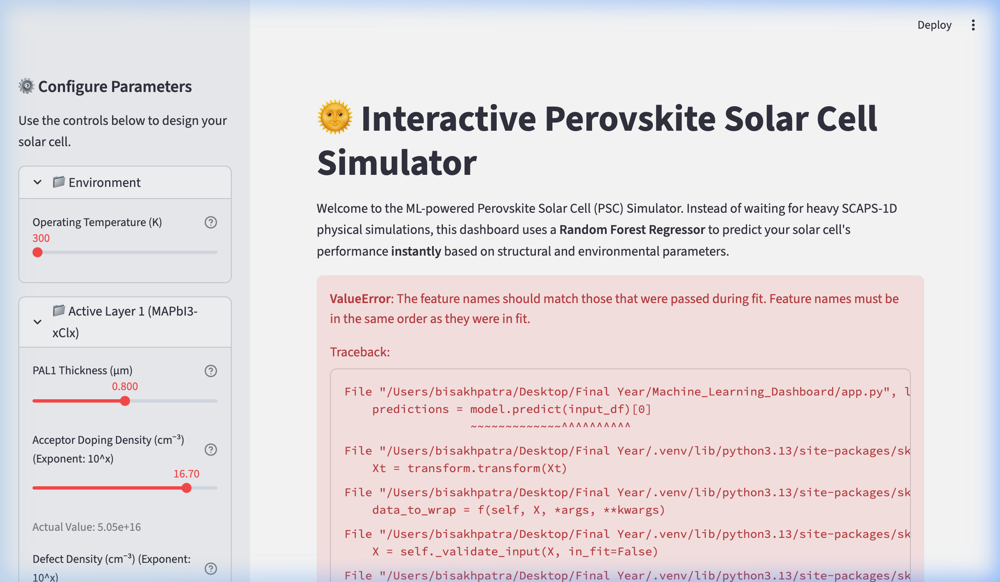
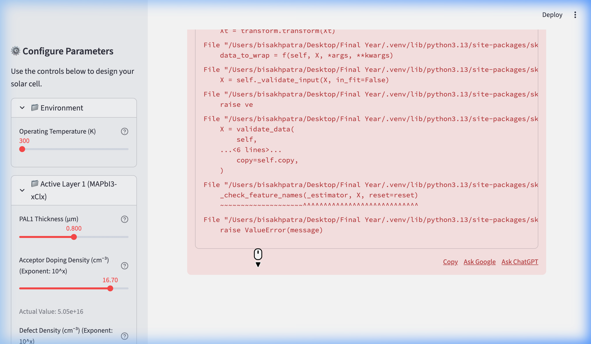

<div align="center">
  
  
  
  
  
  
</div>

<h1 align="center">🌞 Perovskite Solar Cell (PSC) Simulation & Analysis 🔬</h1>

<p align="center">
  <b>Comprehensive analysis and visualization of 1D solar cell simulations (SCAPS-1D) focusing on Perovskite Solar Cells (PSCs) and the effect of different parameters on device performance.</b>
</p>

---

## 📖 Overview

This repository contains my final year project work dedicated to simulating, analyzing, and visualizing the electrical and optical properties of **Perovskite Solar Cells (PSCs)**. By employing SCAPS-1D simulation data, this project deeply investigates how structural changes, varying physical parameters, and environmental factors influence the overall Power Conversion Efficiency (PCE) and stability of the solar cells.

The project utilizes a robust Python data science stack to process simulation outputs and generates publication-ready visualizations, alongside an automated **Node.js report generation tool** to compile and document findings programmatically.

## 🎯 Key Objectives

| Objective | Description |
| :--- | :--- |
| 🌑 **Dark I-V Analysis** | Investigating the dark current-voltage characteristics to understand recombination mechanisms and shunt/series resistance effects. |
| ⚡ **J-V Plotting** | Plotting and extracting key performance metrics ($J_{sc}$, $V_{oc}$, FF, PCE) from simulated illuminated J-V curves. |
| 📏 **Thickness Optimization** | Analyzing the impact of Perovskite Active Layer (PAL), Electron Transport Layer (ETL), and Hole Transport Layer (HTL) thicknesses. |
| 🌡️ **Temperature Stability** | Simulating and visualizing how varying operating temperatures affect solar cell performance metrics. |
| 🌈 **Quantum Efficiency (QE)** | Examining the internal and external quantum efficiency across the light spectrum. |

## 📂 Repository Structure

```text
📁 Final Year Project
│
├── 📁 ETL HTL Sweep                  # Analysis of varying ETL & HTL properties
│   └── 📁 notebook                   # Jupyter notebooks for sweep analysis
│
├── 📁 IV Thickness                   # Impact of layer thickness on I-V curves
│   └── 📁 notebooks                  # plot_IV_thickness.ipynb
│
├── 📁 J-V Plot                       # Illuminated Current Density-Voltage analysis
│   └── 📁 notebook                   # JV_Plot_Final.ipynb, J_V_Plot_Code.ipynb
│
├── 📁 PAL vs PCE Thickness           # Contour analysis: Perovskite layer thickness vs PCE
│   └── 📁 notebooks                  # PAL_Thickness_vs_PCE_Contour_Analysis.ipynb
│
├── 📁 PSC_Dark_IV_Analysis_Project   # Deep dive into dark current-voltage behavior
│   └── 📁 notebooks                  # plot_fixed_graphs.ipynb
│
├── 📁 QE                             # Quantum Efficiency analysis
│   └── 📁 notebook                   # QE_Plot.ipynb
│
├── 📁 Temperature Sweep              # Performance degradation/variation with temperature
│   └── 📁 notebook                   # SCAPS_Temperature_Sweep_Analysis.ipynb
│
└── 📁 Others                         # Report generation scripts (generate_report.js) and related documents
```

> [!NOTE]
> Each sub-directory generally contains its own `data/` (for raw SCAPS outputs) and `graphs/` (for exported figures) folders. Generated documents (PDFs, Word reports) and Node modules are ignored via `.gitignore` to keep the repository clean.

## 🛠️ Technologies & Libraries

*   **Languages:** Python 3.x, JavaScript (Node.js)
*   **Environment:** Jupyter Notebooks
*   **Data Science Core:** `numpy`, `pandas`, `scipy`
*   **Data Visualization:** `matplotlib`, `seaborn`
*   **Report Generation:** `docx` (Node.js)

## 🚀 Getting Started

### 1. Clone the repository
```bash
git clone https://github.com/Asphane/perovskite-cell-scaps-simulation-analysis.git
cd perovskite-cell-scaps-simulation-analysis
```

### 2. Python Environment (Data Analysis)
It is recommended to use a virtual environment for the Python dependencies.
```bash
python -m venv .venv
source .venv/bin/activate  # On Windows: .venv\Scripts\activate
pip install -r Others/req.txt 
```

### 3. Node.js Environment (Automated Reports)
To utilize the automated report generation tools:
```bash
cd Others
npm install
node generate_report.js
```

### 4. Launch Jupyter Notebook
```bash
jupyter notebook
```
*Navigate to the respective directory and open the desired `.ipynb` file to view the analysis.*

## 🤖 Machine Learning Surrogate Dashboard

To move beyond static data visualization, this project includes an interactive, AI-driven web application built with **Streamlit**. Instead of waiting for heavy SCAPS-1D physical simulations, this dashboard uses machine learning to predict solar cell performance instantly.

### Key Features:
- **Instant Forward Predictions**: Uses a **Random Forest Regressor** trained on 1,181 SCAPS simulations to predict PCE, Voc, Jsc, and FF instantly (>98% accuracy).
- **Dynamic J-V Curve**: Uses a **PyTorch Multi-Layer Perceptron (ANN)** to predict and plot the continuous Current-Voltage curve in real-time.
- **Inverse Design Optimizer**: Uses a **Genetic Algorithm** (`differential_evolution`) to automatically find the optimal combination of physical parameters for maximum efficiency.
- **Sensitivity Analysis**: Allows you to see how changing a single parameter affects Efficiency (PCE), holding others constant.
- **Premium UI**: Dark mode, glassmorphism cards, and interactive Plotly charts.

### How to Run:
```bash
.venv/bin/streamlit run Machine_Learning_Dashboard/app.py
```

### App Screenshots:
<div align="center">
  
  <br><br>
  
  <br><br>
  
</div>

## 📊 Visualizations & Outputs

<table align="center">
  <tr>
    <td align="center"><b>Current Density-Voltage (J-V)</b></td>
    <td align="center"><b>Efficiency Contour Analysis</b></td>
  </tr>
  <tr>
    <td align="center"></td>
    <td align="center"></td>
  </tr>
  <tr>
    <td><i>Illuminated J-V curve simulation highlighting key parameters ($V_{oc}$, $J_{sc}$).</i></td>
    <td><i>Contour map showing optimal Perovskite Active Layer (PAL) thickness.</i></td>
  </tr>
  <tr>
    <td align="center"><b>Quantum Efficiency (QE)</b></td>
    <td align="center"><b>Temperature Impact</b></td>
  </tr>
  <tr>
    <td align="center"></td>
    <td align="center"></td>
  </tr>
  <tr>
    <td><i>Internal and external quantum efficiency across the light spectrum.</i></td>
    <td><i>Variation of core performance metrics under differing temperatures.</i></td>
  </tr>
  <tr>
    <td align="center" colspan="2"><b>Dark I-V Analysis</b></td>
  </tr>
  <tr>
    <td colspan="2" align="center"></td>
  </tr>
  <tr>
    <td colspan="2" align="center"><i>Logarithmic plot of dark current-voltage to study recombination mechanisms.</i></td>
  </tr>
</table>

## 🎓 Academic Context

This repository represents the practical implementation and data analysis portion of my Final Year Project. The theoretical background, methodology, and full conclusions are synthesized using the automated tools and documented in the generated reports.

---
<div align="center">
  <i>Developed by Bisakh Patra</i>
</div>
