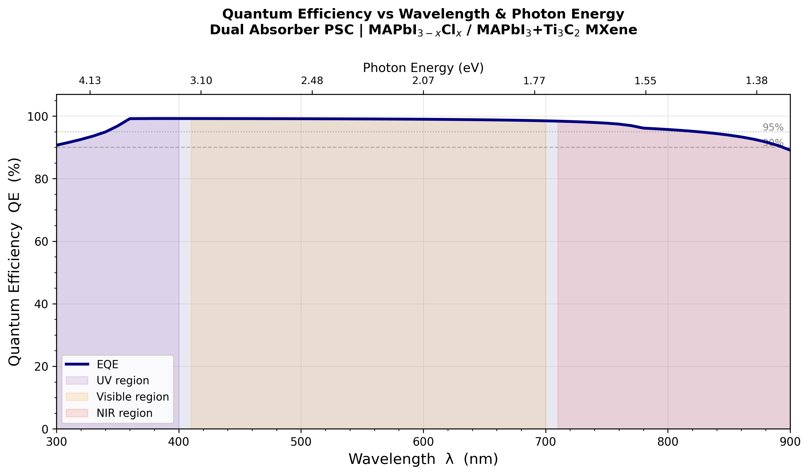
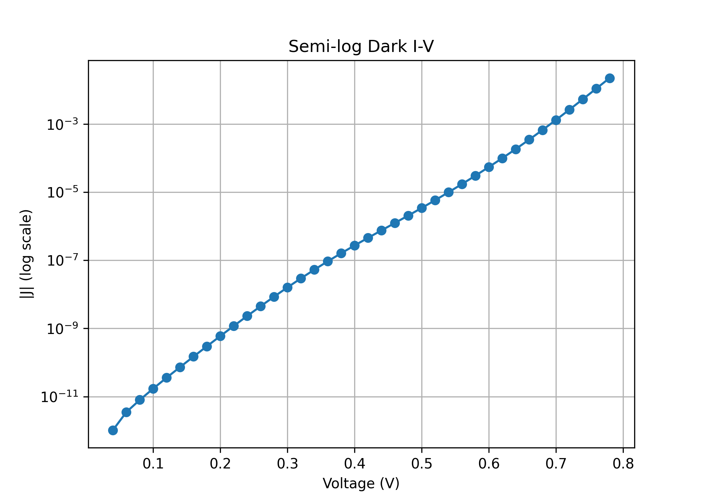

<div align="center">
  
  
  
  
  
</div>

<h1 align="center">🌞 Perovskite Solar Cell (PSC) Simulation & Analysis 🔬</h1>

<p align="center">
  <b>Comprehensive analysis and visualization of 1D solar cell simulations (SCAPS-1D) focusing on Perovskite Solar Cells (PSCs) and the effect of different parameters on device performance.</b>
</p>

---

## 📖 Overview

This repository contains my final year project work dedicated to simulating, analyzing, and visualizing the electrical and optical properties of **Perovskite Solar Cells (PSCs)**. By employing SCAPS-1D simulation data, this project deeply investigates how structural changes, varying physical parameters, and environmental factors influence the overall Power Conversion Efficiency (PCE) and stability of the solar cells.

The project utilizes a robust Python data science stack (Pandas, NumPy, SciPy) to process simulation outputs and generates publication-ready visualizations using Matplotlib and Seaborn.

## 🎯 Key Objectives

*   **Dark I-V Analysis:** Investigating the dark current-voltage characteristics to understand recombination mechanisms and shunt/series resistance effects.
*   **J-V Plotting:** Plotting and extracting key performance metrics ($J_{sc}$, $V_{oc}$, FF, PCE) from simulated illuminated J-V curves.
*   **Thickness Optimization:** Analyzing the impact of Perovskite Active Layer (PAL), Electron Transport Layer (ETL), and Hole Transport Layer (HTL) thicknesses on device efficiency.
*   **Temperature Stability:** Simulating and visualizing how varying operating temperatures affect solar cell performance metrics.
*   **Quantum Efficiency (QE):** Examining the internal and external quantum efficiency across the light spectrum.

## 📂 Repository Structure

The project is structured into modular analytical domains:

```text
📁 Final Year Project
│
├── 📁 ETL HTL Sweep                  # Analysis of varying ETL & HTL properties
│   └── 📁 notebook                   # Jupyter notebooks for sweep analysis
│
├── 📁 IV Thickness                   # Impact of layer thickness on I-V curves
│   └── 📁 notebooks                  # plot_IV_thickness.ipynb
│
├── 📁 J-V Plot                       # Illuminated Current Density-Voltage analysis
│   └── 📁 notebook                   # JV_Plot_Final.ipynb, J_V_Plot_Code.ipynb
│
├── 📁 PAL vs PCE Thickness           # Contour analysis: Perovskite layer thickness vs PCE
│   └── 📁 notebooks                  # PAL_Thickness_vs_PCE_Contour_Analysis.ipynb
│
├── 📁 PSC_Dark_IV_Analysis_Project   # Deep dive into dark current-voltage behavior
│   └── 📁 notebooks                  # plot_fixed_graphs.ipynb
│
├── 📁 QE                             # Quantum Efficiency analysis
│   └── 📁 notebook                   # QE_Plot.ipynb
│
├── 📁 Temperature Sweep              # Performance degradation/variation with temperature
│   └── 📁 notebook                   # SCAPS_Temperature_Sweep_Analysis.ipynb
│
├── 📄 req.txt                        # Python dependencies
└── 📄 PSC_Final_Year_Report.docx     # Comprehensive project thesis/report
```

*Note: Each sub-directory generally contains its own `data/` (for raw SCAPS outputs) and `graphs/` (for exported figures) folders.*

## 🛠️ Technologies & Libraries

This project relies heavily on the Python data science ecosystem for data manipulation and visualization:

*   **Language:** Python 3.x
*   **Environment:** Jupyter Notebooks
*   **Core Libraries:**
    *   `numpy` - Numerical computations and array processing
    *   `pandas` - Data parsing, manipulation, and CSV handling
    *   `scipy` - Scientific and technical computing (curve fitting, interpolation)
    *   `matplotlib` - Foundational plotting and figure generation
    *   `seaborn` - High-level statistical data visualization

## 🚀 Getting Started

To run the notebooks and reproduce the visualizations locally:

1.  **Clone the repository:**
    ```bash
    git clone https://github.com/your-username/psc-simulation-analysis.git
    cd psc-simulation-analysis
    ```

2.  **Set up a virtual environment (Recommended):**
    ```bash
    python -m venv .venv
    source .venv/bin/activate  # On Windows use: .venv\Scripts\activate
    ```

3.  **Install dependencies:**
    ```bash
    pip install -r req.txt
    ```

4.  **Launch Jupyter Notebook:**
    ```bash
    jupyter notebook
    ```
    *Navigate to the respective directory and open the desired `.ipynb` file to view the analysis.*

## 📊 Sample Outputs & Visualizations

Here is a glimpse of the analytical plots generated within this project:

### 1. Current Density-Voltage (J-V) Characteristics

*Illuminated J-V curve simulation highlighting key photovoltaic parameters like Open-Circuit Voltage ($V_{oc}$) and Short-Circuit Current Density ($J_{sc}$).*

### 2. Efficiency Contour Analysis

*Contour map demonstrating the optimal thickness ranges for the Perovskite Active Layer (PAL) to maximize Power Conversion Efficiency (PCE).*

### 3. Quantum Efficiency (QE) Spectrum

*Analysis of internal and external quantum efficiency across the visible light spectrum, indicating photon absorption effectiveness.*

### 4. Temperature Impact on Cell Parameters

*Simulation demonstrating the variation of core performance metrics (like $V_{oc}$, $J_{sc}$, FF, and PCE) under differing operating temperatures.*

### 5. Dark I-V Analysis

*Logarithmic plot of dark current-voltage characteristics to study recombination mechanisms and leakage currents.*

## 🎓 Academic Context

This repository represents the practical implementation and data analysis portion of my Final Year Project. The theoretical background, methodology, and full conclusions are documented in the accompanying `PSC_Final_Year_Report.docx`.

---
<div align="center">
  <i>Developed by Bisakh Patra</i>
</div>
